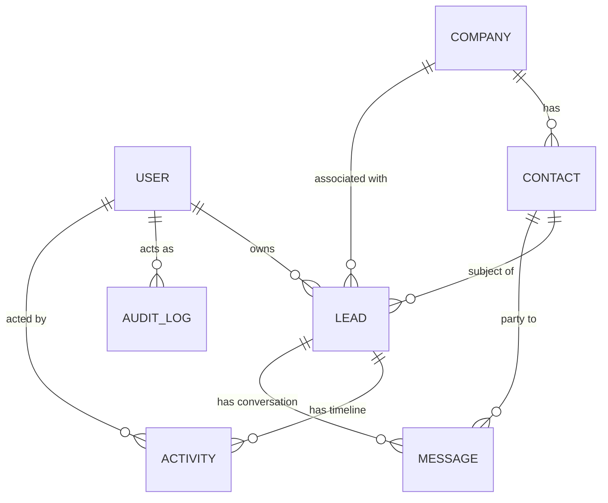
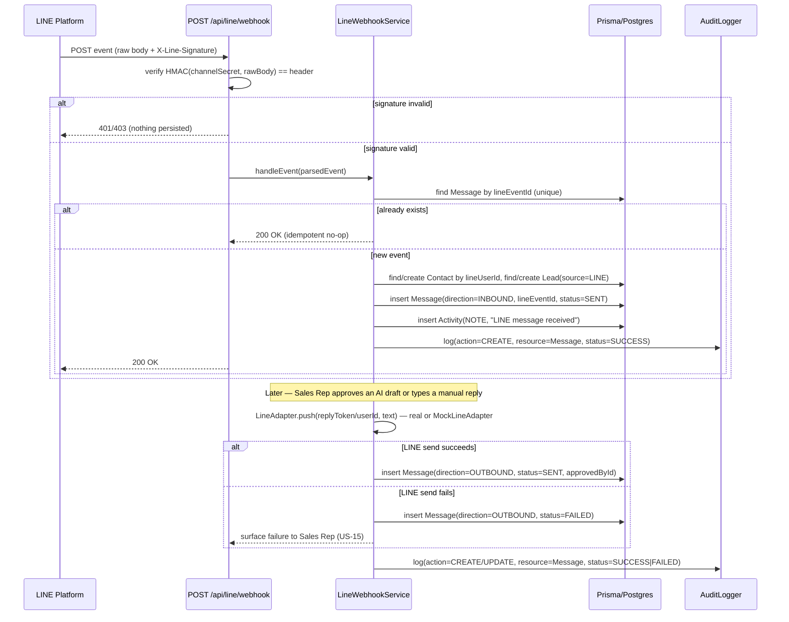
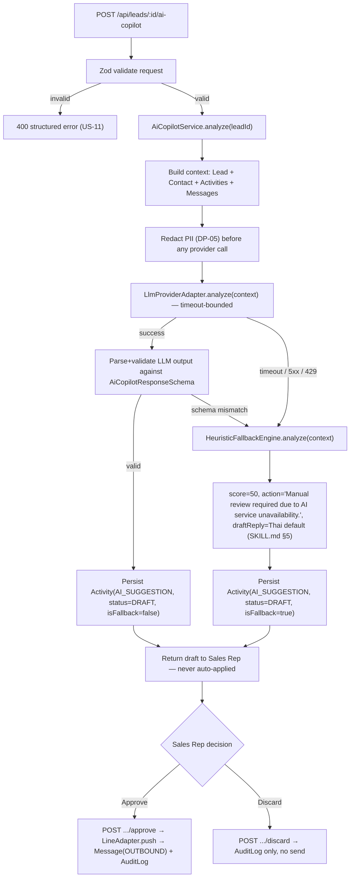

# 02 — Technical Architecture (SA)

**Builds on:** `docs/01-REQUIREMENTS-BA.md` (user stories US-01…US-17, rules §3, RBAC §4, DP-01…DP-08)
**Constraints:** `.env.agent-context` §1–2 (Next.js App Router, Prisma/PostgreSQL, strict Zod, AuditLogger on every mutation, LINE signature verification, PII redaction)

---

## 1. Layered Architecture — Next.js App Router

```
Presentation          app/(dashboard)/**/page.tsx, components/**       — React Server/Client Components, no business logic
        │
BFF (Route Handlers)  app/api/**/route.ts                              — HTTP contract only: parse+Zod validate, call service, map to ApiResponse
        │
Service Layer         src/core/services/**                             — business rules from BA §3, orchestrates repository + AuditLogger + AI/LINE adapters
        │
Repository Layer      src/core/repositories/**                         — only place that imports @prisma/client; no business logic
        │
Infra Adapters        src/core/integrations/{line,ai}/**                — LINE Messaging API client + mock, LLM provider client + heuristic fallback
```

**Rule:** a Route Handler never calls `prisma` directly and a Service never imports `next/server`.
This is the one architectural boundary QA's RBAC-violation and audit tests rely on being unbypassable
from the client.

### 1.1 Existing code vs. this design (as of SA handoff)
| File | State | Gap this doc closes |
|---|---|---|
| `src/core/audit/audit-logger.ts` | Writes to `console.log` only | §5 below: must persist to `AuditLog` table |
| `src/core/errors/api-response.ts` | Implemented, matches `ApiResponse<T>` contract used below | — |
| `prisma/schema.prisma` | Only `AuditLog` model exists | §2 below: adds User/Company/Contact/Lead/Activity/Message |
| `src/middleware.ts` | Only stamps `x-client-ip` | §4.3: needs route-group auth/session gate |
| `package.json` | No `prisma` CLI devDependency, no `bcrypt`/session lib | DEV Agent must add before schema/migrations work |

---

## 2. Database ERD & Entity Schemas



### 2.1 Prisma schema additions (implemented by DEV Agent in Step 4)

```prisma
enum UserRole {
  ADMIN
  SALES_MANAGER
  SALES_REP
}

enum LeadStage {
  NEW
  QUALIFIED
  PROPOSAL
  WON
  LOST
}

enum LeadSource {
  WEBSITE
  MANUAL
  LINE
}

enum ActivityType {
  STAGE_CHANGE
  NOTE
  AI_SUGGESTION
  AI_ACTION
}

enum MessageDirection {
  INBOUND
  OUTBOUND
}

enum MessageStatus {
  DRAFT
  SENT
  FAILED
  PENDING_RETRY
}

model User {
  id            String   @id @default(uuid())
  email         String   @unique
  passwordHash  String
  name          String
  role          UserRole @default(SALES_REP)
  createdAt     DateTime @default(now())
  updatedAt     DateTime @updatedAt
  leads         Lead[]
  activities    Activity[]
}

model Company {
  id        String    @id @default(uuid())
  name      String
  industry  String?
  website   String?
  createdAt DateTime  @default(now())
  updatedAt DateTime  @updatedAt
  deletedAt DateTime?
  contacts  Contact[]
  leads     Lead[]

  @@index([deletedAt])
}

model Contact {
  id         String    @id @default(uuid())
  companyId  String
  company    Company   @relation(fields: [companyId], references: [id])
  name       String
  email      String?
  phone      String?
  lineUserId String?   @unique
  createdAt  DateTime  @default(now())
  updatedAt  DateTime  @updatedAt
  deletedAt  DateTime?
  leads      Lead[]
  messages   Message[]

  @@index([companyId])
  @@index([deletedAt])
}

model Lead {
  id         String     @id @default(uuid())
  contactId  String
  contact    Contact    @relation(fields: [contactId], references: [id])
  companyId  String
  company    Company    @relation(fields: [companyId], references: [id])
  ownerId    String
  owner      User       @relation(fields: [ownerId], references: [id])
  stage      LeadStage  @default(NEW)
  source     LeadSource
  budget     Int?       // integer minor units, never float — BA §3.5
  scopeNotes String?
  aiScore    Int?       // last AI qualification score, nullable until first analysis
  createdAt  DateTime   @default(now())
  updatedAt  DateTime   @updatedAt
  deletedAt  DateTime?
  activities Activity[]
  messages   Message[]

  @@index([ownerId])
  @@index([stage])
  @@index([deletedAt])
}

model Activity {
  id        String       @id @default(uuid())
  leadId    String
  lead      Lead         @relation(fields: [leadId], references: [id])
  actorId   String
  actor     User         @relation(fields: [actorId], references: [id])
  type      ActivityType
  payload   Json         // stage from/to, note text, or AI suggestion {summary,score,nextAction,draftReply,status}
  viaAI     Boolean      @default(false)
  createdAt DateTime     @default(now())

  @@index([leadId])
  @@index([createdAt])
}

model Message {
  id          String            @id @default(uuid())
  leadId      String
  lead        Lead              @relation(fields: [leadId], references: [id])
  contactId   String
  contact     Contact           @relation(fields: [contactId], references: [id])
  direction   MessageDirection
  channel     String            @default("LINE")
  lineEventId String?           @unique   // idempotency key — DP-04
  content     String
  status      MessageStatus     @default(SENT)
  viaAI       Boolean           @default(false)
  approvedById String?
  createdAt   DateTime          @default(now())

  @@index([leadId])
  @@index([contactId])
}

model AuditLog {
  // unchanged from existing schema — see §5
}
```

**Constraint notes (BA §3 traceability):**
- `Contact.lineUserId` and `Message.lineEventId` are `@unique` — this is the DB-level enforcement for
  US-13 idempotency (DP-04), not just application logic.
- Soft delete via nullable `deletedAt` on Company/Contact/Lead (BA §3.1) — repositories filter
  `deletedAt: null` by default; no hard `DELETE` is exposed.
- `Activity.payload` (Json) carries AI suggestion drafts (`AI_SUGGESTION`) so no separate
  "AiSuggestion" entity is introduced beyond the six entities named in `.env.agent-context` §1.

---

## 3. REST API Contracts (Zod request/response schemas)

All responses use the existing `ApiResponse<T>` envelope from `src/core/errors/api-response.ts`.
All mutating routes call `AuditLogger.log()` (see §5) before returning.

| Method & Path | Auth (RBAC §4) | Purpose | Traces to |
|---|---|---|---|
| `POST /api/auth/login` | Public | Session login (demo auth) | US-01 |
| `POST /api/auth/logout` | Session | Clear session | US-01 |
| `GET /api/companies` | Session | List/search companies | US-02, US-06 |
| `POST /api/companies` | Session | Create company | US-02 |
| `GET /api/contacts?companyId=&q=` | Session | List/search contacts | US-02, US-06 |
| `POST /api/contacts` | Session | Create contact (dup warning) | US-02, BA §3.2 |
| `GET /api/leads?stage=&ownerId=&q=&page=` | Session | Filtered/paginated pipeline list | US-06 |
| `POST /api/leads` | Session | Create lead (any source) | US-03 |
| `GET /api/leads/:id` | Session (own or Manager/Admin) | Lead detail + merged timeline | US-05 |
| `PATCH /api/leads/:id/stage` | Session, owner or Manager/Admin | Stage transition, blocks terminal reopen unless Admin | US-04 |
| `PATCH /api/leads/:id/owner` | Manager/Admin | Reassign owner | RBAC §4 |
| `POST /api/leads/:id/ai-copilot` | Session | Request AI analysis → `Activity(AI_SUGGESTION, DRAFT)` | US-08, US-10, US-11 |
| `POST /api/leads/:id/ai-copilot/:activityId/approve` | Session, owner or Manager/Admin | Send drafted LINE reply | US-09, US-14 |
| `POST /api/leads/:id/ai-copilot/:activityId/discard` | Session | Discard draft, audit-only write | US-09 |
| `POST /api/line/webhook` | LINE signature (not session) | Inbound event ingest | US-12, US-13 |
| `GET /api/audit-logs?resource=&actorId=` | Manager (team scope)/Admin (full) | Audit trail read | DP-01, DP-02 |

### 3.1 Representative Zod contracts

```ts
// Lead stage transition — PATCH /api/leads/:id/stage
export const StageTransitionSchema = z.object({
  toStage: z.enum(['NEW', 'QUALIFIED', 'PROPOSAL', 'WON', 'LOST']),
});
// Service layer enforces: terminal-state guard (BA §3.1), not Zod's job.

// AI Copilot request — POST /api/leads/:id/ai-copilot
export const AiCopilotRequestSchema = z.object({
  leadId: z.string().uuid(),
});
export const AiCopilotResponseSchema = z.object({
  activityId: z.string().uuid(),
  summary: z.array(z.string()).max(3),
  qualificationScore: z.number().int().min(0).max(100),
  scoreReasoning: z.string(),
  nextBestAction: z.string(),
  draftLineReply: z.string().max(200),
  isFallback: z.boolean(), // true when heuristic engine answered — US-10
});

// LINE webhook inbound — POST /api/line/webhook
// NOTE: raw body must be read BEFORE Zod parsing so the HMAC check (§4.2) runs against the
// untouched bytes; Zod validates the shape only after signature passes.
export const LineWebhookEventSchema = z.object({
  destination: z.string(),
  events: z.array(z.object({
    type: z.string(),
    webhookEventId: z.string(),        // idempotency key, DP-04
    source: z.object({ userId: z.string(), type: z.literal('user') }),
    message: z.object({ id: z.string(), type: z.literal('text'), text: z.string() }).optional(),
    replyToken: z.string().optional(),
    timestamp: z.number(),
  })),
});
```

---

## 4. Security Controls

### 4.1 OWASP Top 10 mapping

| Risk | Control |
|---|---|
| A01 Broken Access Control | Service-layer RBAC checks per BA §4 matrix; never trust client role claims; session-derived role only |
| A02 Cryptographic Failures | Passwords hashed (bcrypt/argon2, not stored plain); LINE Channel Secret only in env, never logged |
| A03 Injection | Prisma parameterized queries only; zero raw SQL string interpolation |
| A04 Insecure Design | AI/LINE actions are draft-then-approve by design (BA §3.3), not bolt-on filtering |
| A05 Security Misconfiguration | `next.config.js` already sets CSP/X-Frame-Options/etc. — extend `connect-src` only for the actual AI provider host, not `*` |
| A07 Auth Failures | Generic login error (US-01), session cookie `httpOnly`+`secure`+`sameSite=lax` |
| A08 Data Integrity Failures | LINE HMAC signature check before parsing (§4.2); idempotency unique constraint (DP-04) |
| A09 Logging Failures | AuditLog persisted (§5), redaction before persist/AI-send (DP-05) |
| A10 SSRF | AI/LINE outbound calls only to allow-listed hostnames read from env, not user input |

### 4.1b AI/LLM-specific risks (OWASP Top 10 for LLM Applications subset)

The mapping above covers the generic web OWASP Top 10; AI Copilot also carries its own risk category
that a web-only threat model misses entirely — worth naming explicitly since the untrusted input here
(a customer's LINE message) flows directly into an LLM prompt.

| Risk | Control |
|---|---|
| LLM01 Prompt Injection | Customer-supplied message/note text is scanned for common injection phrasing and neutralized (`src/core/integrations/ai/prompt-guard.ts`) before it reaches the LLM payload; the system prompt explicitly instructs the model to treat the JSON context as untrusted data only, never follow instructions embedded in it, and never reveal itself |
| LLM02 Insecure Output Handling | Engine output (real provider or heuristic) is always validated against `AiCopilotResultSchema` (zod) before being persisted or shown; a malformed/oversized response degrades to the heuristic fallback rather than being trusted raw (SA §7) |
| LLM06 Sensitive Information Disclosure | PII is redacted from the context before it reaches the LLM (`redact.ts`, DP-05); AI Copilot actions are ownership-scoped (RBAC §4) so a Sales Rep's queries can only ever expose their own leads' data to the model, not a teammate's |

### 4.2 LINE webhook signature verification (DP-03)
```
computedSignature = base64(HMAC-SHA256(channelSecret, rawRequestBody))
reject unless timing-safe-equal(computedSignature, header['x-line-signature'])
```
Must run on the **raw** body (Next.js Route Handlers require reading `request.text()` before any
`.json()` parsing) — this is a common bug source: framework body-parsing before signature check
silently defeats the control.

### 4.3 Session/RBAC enforcement point
`src/middleware.ts` currently only stamps `x-client-ip`. It is extended (DEV Agent) to redirect
unauthenticated requests away from `app/(dashboard)/**` and to reject unauthenticated `app/api/**`
calls (except `/api/auth/login` and `/api/line/webhook`, which authenticate differently — session vs.
HMAC). Fine-grained role checks (e.g., "Manager-only reassign") live in the Service layer, not
middleware, because they need the specific resource's owner to evaluate "own lead" vs. "any lead."

The "own lead vs. any lead" check itself is centralized in `assertOwnsLead` (`src/core/auth/lead-ownership.ts`)
and shared by every service that reads/mutates a Lead (`lead.service.ts`, `ai-copilot.service.ts`) — it
was originally duplicated inline per service, which is exactly how `ai-copilot.service.ts` shipped
without it at first (caught and fixed in a later security pass, then unified into this shared guard so
a third consumer can't repeat the omission).

### 4.4 Rate limiting
Given the 16-hour timebox, full distributed rate limiting is out of scope. Minimum viable: an
in-memory sliding-window limiter on `POST /api/line/webhook` and `POST /api/leads/:id/ai-copilot`
(the two externally-triggerable/costly routes), documented as a known limitation for a real
multi-instance deployment (would need Redis) in `03-PROJECT-PLAN-PM.md` risk register.

---

## 5. Immutable Audit Log — Schema & Integration Strategy

**Current gap:** `AuditLogger.log()` (`src/core/audit/audit-logger.ts`) only `console.log`s; the
`AuditLog` Prisma model exists but nothing writes to it. This SA doc's integration strategy, to be
implemented in Step 4:

1. `AuditLogger.log(payload)` sanitizes (existing regex-redaction of password/token/secret/creditCard)
   **then** calls `prisma.auditLog.create({ data: logEntry })`, keeping the `console.log` for local
   dev visibility.
2. Called **after** the service-layer mutation succeeds, inside the same request — not queued —
   so a request that returns `200` is guaranteed to have an audit row (append-only, DP-02).
3. If the audit write itself throws, the error is caught, logged via `console.error` with full
   context, and does **not** roll back the already-committed business mutation — documented
   trade-off: prioritizing salesperson availability over losing an in-flight CRM write on an audit-DB
   blip, with the gap surfaced via the `console.error` line for local dev. A production version would
   use a DB transaction wrapping both writes, or an outbox pattern; out of scope for a 16-hour MVP,
   captured as a "known limitation" for `03-PROJECT-PLAN-PM.md` / README.
4. `AuditLog` rows are never targeted by `UPDATE`/`DELETE` in any repository — enforced by
   convention (no `auditLogRepository.update/delete` methods exist at all, so there's no code path
   to misuse).

---

## 6. LINE Webhook Sequence (US-12, US-13, US-14)



---

## 7. AI Copilot Fallback Architecture (US-08, US-10, US-11)



**Design decision:** the fallback is a same-interface swap (`AiCopilotResponseSchema` shape is
identical for LLM and heuristic paths, differing only in `isFallback`), so the Route Handler and UI
never branch on which engine answered — this satisfies `SKILL.md` §5 ("fallback gracefully") without
duplicating response-handling logic. `LlmProviderAdapter` and `HeuristicFallbackEngine` both
implement the same TypeScript interface (`AiCopilotEngine`), so swapping/mocking either in tests
(QA Agent, Step 5) requires no changes to the Service layer.

---

## 8. Known architectural risks (feed into PM risk register)

1. `AuditLogger` not yet persisting (gap above) — must land before any QA audit-trail test can pass.
2. No `tsconfig.json`, no `package-lock.json`, no `prisma` CLI devDependency present yet — build/CI
   will fail until DEV Agent adds them (Step 4, before writing feature code).
3. `next.config.js` CSP `connect-src 'self'` will need the real AI provider + LINE API hostnames added
   once that provider is chosen, or LLM calls will be blocked client-side if ever called from the
   browser (they should not be — all LLM calls happen server-side in the Service layer, so this is a
   defense-in-depth note, not a blocker).
4. In-memory rate limiting (§4.4) does not survive a multi-instance/serverless deployment — documented
   limitation, not fixed in this MVP.
5. CSP `script-src` includes `'unsafe-inline' 'unsafe-eval'` (`next.config.js`) — loosens XSS
   mitigation from a strict CSP. A nonce-based strict CSP is the correct next hardening step;
   not changed here to avoid an unverified edit to the live site's security headers this late in
   the timeline. No `eval`/`Function`/`dangerouslySetInnerHTML` exists anywhere in `src/` today, so
   `'unsafe-eval'` is very likely droppable — worth confirming with a full rebuild + smoke test before
   tightening it.
6. `lineWebhookService.processEvents` (§6) does all DB writes synchronously inside the webhook request
   — no queue between "signature verified" and "persisted." Acceptable at demo volume; a production
   deployment under real message bursts should ack fast and move persistence to a background
   queue/worker, so a slow write can't threaten LINE's webhook response-time expectations.

---

*Next: `docs/03-PROJECT-PLAN-PM.md` (PM Agent) — WBS, Requirements Traceability Matrix, risk register,
Definition of Done — built on top of this document.*
